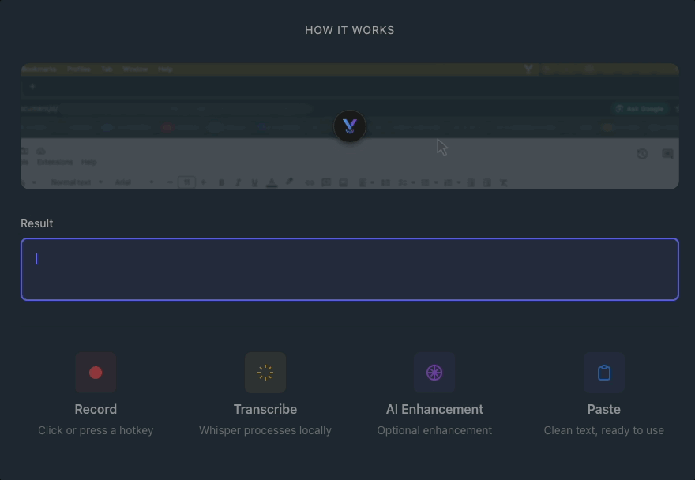

# Vox

Open-source voice-to-text app with local Whisper transcription and AI-powered correction.

[](https://usevox.app/)
[](https://github.com/app-vox/vox/actions/workflows/ci.yml)
[](https://github.com/app-vox/vox/actions/workflows/release.yml)
[](https://codecov.io/gh/app-vox/vox)
[](LICENSE)
[](https://www.apple.com/macos/)
[](https://www.microsoft.com/windows/)
[](https://buymeacoffee.com/rodrigoluizs)

Hold a keyboard shortcut, speak, and Vox transcribes your voice locally using [whisper.cpp](https://github.com/ggerganov/whisper.cpp), optionally corrects it with AI, and pastes the text into your active app.

## Demo

<div align="center">



</div>

> **Platform Support**
> Vox runs on **macOS** (Apple Silicon and Intel) and **Windows** (10+). Linux support is planned for future releases.

## Table of Contents

- [Quick Start](#quick-start)
- [Features](#features)
- [Use Cases](#use-cases)
- [How Vox Compares](#how-vox-compares)
- [Requirements](#requirements)
- [Configuration](#configuration)
- [Usage](#usage)
- [FAQ](#faq)
- [Development](#development)
- [Contributing](#contributing)
- [License](#license)

## Quick Start

Download the latest version from the [releases page](https://github.com/app-vox/vox/releases/latest).

- **macOS**: Drag `Vox.app` to your Applications folder.
- **Windows**: Run the installer (`.exe`) and follow the setup wizard.

## First Launch

When you first launch Vox, you'll need to:

1. **Download a Whisper Model** — Go to Settings > Local Model and download at least one speech recognition model. The "small" model (Recommended) is a good starting point.

2. **Grant Permissions** — Vox needs:
   - **Microphone**: Required for voice recording
   - **Accessibility**: Required for keyboard shortcuts and auto-paste

3. **Configure Shortcuts** (optional) — Customize keyboard shortcuts in Settings > Shortcuts

4. **Enable AI Improvements** (optional) — Configure LLM provider in Settings > AI Improvements

Vox will guide you through this setup process with visual indicators showing what's incomplete.

Once configured, hold `Alt+Space` to start recording.

## Features

- **🔒 100% Local transcription** — Powered by whisper.cpp, audio stays on your device
- **🤖 AI correction** — Removes filler words and fixes grammar (optional)
- **⚙️ Custom prompts** — Tailor corrections for medical, technical, creative, or any workflow
- **⌨️ Hold or toggle modes** — Press-and-hold or toggle recording on/off
- **📋 Auto-paste** — Text is pasted directly into your focused app
- **🎯 Multiple models** — Choose speed vs accuracy (tiny to large)
- **☁️ Multiple LLM providers** — OpenAI-compatible or AWS Bedrock
- **🎨 Menu bar app** — Runs quietly in the background with dark/light mode support

## Use Cases

### 👨‍⚕️ Medical Professionals
Preserve medical terminology and standard abbreviations. Vox understands context and won't autocorrect "OA" to "okay" or "PT" to "patient."

**Example custom prompt:**
> "Preserve medical terminology, standard abbreviations (e.g., OA, PT, BP), and format as clinical notes."

### 👨‍💻 Developers & Engineers
Format technical dictation as concise documentation. Remove filler words while keeping technical terms intact.

**Example custom prompt:**
> "Format as technical documentation. Be concise, remove filler words, preserve code terms and abbreviations."

### ✍️ Writers & Content Creators
Enhance prose while maintaining your unique voice. Turn spoken ideas into polished text ready for editing.

**Example custom prompt:**
> "Enhance prose for readability while maintaining the author's voice. Fix grammar but keep the casual tone."

### 🌍 Language Learners
Practice speaking by translating and correcting your speech in real-time.

**Example custom prompt:**
> "Translate to German and correct grammar. Output only the German translation."

### 📝 Note-Taking & Productivity
Capture thoughts quickly without typing. Perfect for meetings, brainstorming, or journaling.

## How Vox Compares

| Feature | Vox | Dragon NaturallySpeaking | macOS Dictation | Whisper Desktop Apps |
|---------|-----|--------------------------|-----------------|---------------------|
| **Price** | Free & Open Source | $300+ | Free (limited) | Varies ($0-50) |
| **Privacy** | 100% Local | Cloud-based | Cloud-based | Mostly local |
| **Custom Prompts** | ✅ Full control | ❌ Limited | ❌ None | ⚠️ Some apps |
| **AI Enhancement** | ✅ Your own API | ❌ None | ⚠️ Basic | ⚠️ Varies |
| **Offline Mode** | ✅ Full | ⚠️ Limited | ❌ Requires internet | ✅ Most |
| **Native App** | ✅ Menu bar / tray | ⚠️ Full app | ✅ Built-in | ✅ Varies |
| **Custom Shortcuts** | ✅ Configurable | ✅ Yes | ⚠️ Limited | ✅ Most |
| **Open Source** | ✅ FSL-1.1-ALv2 | ❌ Proprietary | ❌ Proprietary | ⚠️ Some |

**Why Vox?**
- **Privacy-first**: Your audio never leaves your device
- **Flexibility**: Use any OpenAI-compatible LLM or AWS Bedrock
- **Customization**: Tailor AI corrections to your exact needs
- **Free & Open**: No subscription, no cloud lock-in

## Requirements

- **macOS** (Apple Silicon or Intel) or **Windows** (10+)
- **LLM provider** (optional) — for text correction:
  - OpenAI-compatible endpoint with API key
  - Or AWS Bedrock credentials with model access

## Configuration

### Whisper Models

Download at least one model from the Whisper tab:

| Model  | Size    | Speed  | Accuracy |
|--------|---------|--------|----------|
| tiny   | ~75 MB  | Fastest| Lower    |
| base   | ~140 MB | Fast   | Decent   |
| small  | ~460 MB | Good   | Good     |
| medium | ~1.5 GB | Slow   | Better   |
| large  | ~3 GB   | Slowest| Best     |

### LLM Provider

**Foundry (OpenAI-compatible)**
- Endpoint URL
- API key
- Model name (e.g., `gpt-4o`)

**AWS Bedrock**
- AWS region
- Credentials (access key, profile, or default chain)
- Model ID (e.g., `anthropic.claude-3-5-sonnet-20241022-v2:0`)

### Shortcuts

Customize keyboard shortcuts in the Shortcuts tab:
- **Hold mode** (default: `Alt+Space`)
- **Toggle mode** (default: `Alt+Shift+Space`)

## Usage

Once configured, Vox runs as a menu bar icon.

Press your shortcut to record. The floating indicator shows:
- **Red** — Recording
- **Yellow** — Transcribing
- **Blue** — Correcting (if LLM enabled)

Release (hold mode) or press again (toggle mode) to stop. Text is pasted automatically.

If correction fails, raw transcription is used. If transcription is empty (silence/noise), nothing is pasted.

## Development

### Setup

> Requires [cmake](https://cmake.org/download).

```bash
git clone https://github.com/app-vox/vox.git
cd vox
make install   # installs npm deps + builds whisper.cpp
```

### Run

```bash
make start      # development with hot reload (alias: make dev)
make stop       # stop dev processes
npm test        # run tests
npm run dist    # build production app
```

### Code Search with ChunkHound (optional)

`make install` automatically sets up [ChunkHound](https://github.com/ofriw/chunkhound) for AI-powered code search. The CLI provides semantic and regex search over the indexed codebase:

```bash
# Semantic search (works immediately after make install)
chunkhound search "authentication logic"

# Regex search (fast pattern matching)
chunkhound search --regex "class \w+Module"

# Broad semantic queries for architecture questions
chunkhound search "error handling patterns retry logic"
```

**Configuration**: ChunkHound config is in `.chunkhound.json`:

```json
{
  "embedding": {
    "provider": "openai",
    "base_url": "http://localhost:11434/v1",
    "model": "nomic-embed-text"
  },
  "llm": {
    "provider": "openai",
    "base_url": "http://localhost:11434/v1",
    "model": "qwen2.5-coder:7b",
    "api_key": "ollama"
  }
}
```

**Ollama setup** (macOS only, for semantic search):

```bash
make embeddings        # starts Ollama + pulls nomic-embed-text if needed + re-indexes
make embeddings-stop   # stops Ollama
```

Without Ollama, ChunkHound uses regex-only search (still fast and useful for exact patterns).

**MCP mode** (opt-in): for deep multi-hop research, copy `.mcp.json.example` to `.mcp.json` and restart Claude Code. Note: MCP locks the DuckDB, so CLI won't work while it's active — use one or the other.

Built with Electron, React, TypeScript, and whisper.cpp.

## Contributing

Contributions welcome! To contribute:

1. Fork and create a feature branch
2. Make your changes
3. Run `npm run typecheck && npm run lint && npm test`
4. Commit with [Conventional Commits](https://www.conventionalcommits.org/) (e.g., `feat(audio): add noise gate`)
5. Open a pull request

⚠️ See more details in [CONTRIBUTING.md](CONTRIBUTING.md).

## FAQ

### Is Vox really free?
Yes, Vox is 100% free and open-source. Transcription runs locally using Whisper.cpp. If you use optional AI enhancement, you'll need your own API keys (OpenAI-compatible or AWS Bedrock), but there are no fees from Vox.

### Does my audio leave my device?
No. Transcription happens entirely on your device. Only if you enable AI enhancement does the *text* (not audio) get sent to your configured LLM provider for correction. Your audio recordings never leave your device.

### What's the difference between local transcription and AI enhancement?
- **Local transcription**: Whisper.cpp converts your speech to text on your device. Fast, accurate, 100% private.
- **AI enhancement** (optional): Sends the transcribed *text* to an LLM to remove filler words ("um", "uh"), fix grammar, or apply custom corrections based on your prompt.

### Which Whisper model should I use?
- **Small** (~460MB): Best balance of speed and accuracy. Recommended for most users.
- **Tiny/Base**: Faster but less accurate. Good for quick notes.
- **Medium/Large**: Slower but more accurate. Good for technical/medical content or noisy environments.

You can switch models anytime in Settings.

### Can I use Vox with Claude/ChatGPT/other LLMs?
Yes! Vox works with:
- **OpenAI-compatible APIs**: OpenAI, Anthropic (via Bedrock), OpenRouter, local LLMs with OpenAI-compatible endpoints
- **AWS Bedrock**: Claude, Llama, Mistral, and other Bedrock models

### Does Vox work offline?
Yes. Local transcription works 100% offline. AI enhancement requires internet (since it calls your LLM provider API), but you can disable it and use raw transcription offline.

### Why does Vox need Accessibility permissions?
Vox needs Accessibility access to:
1. Listen for your custom keyboard shortcuts globally
2. Simulate paste (`Cmd+V` on macOS, `Ctrl+V` on Windows) to insert transcribed text into your active app

Without this, Vox can't detect shortcuts or auto-paste text.

### Can I contribute to Vox?
Absolutely! Vox is open-source. See [CONTRIBUTING.md](CONTRIBUTING.md) for guidelines. We welcome bug reports, feature requests, and pull requests.

### What about Linux?
Vox runs on macOS and Windows. Linux support is planned — follow the repo for updates!

## License

This project is licensed under the [Functional Source License, Version 1.1, ALv2 Future License](LICENSE).

You can use, modify, and redistribute the code for any purpose **except** building a competing commercial product or service. After two years, each release automatically converts to the [Apache License 2.0](https://www.apache.org/licenses/LICENSE-2.0).

See [LICENSE](LICENSE) for full details.
